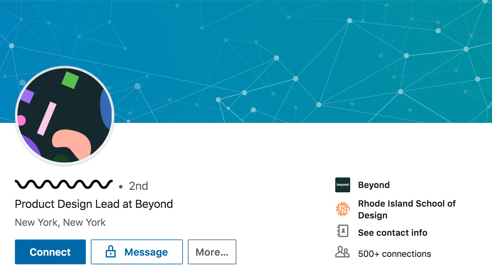

# antibias-chrome-extension

Chrome extension designed to reduce implicit bias by obfuscating profile names and images on LinkedIn.

* Chrome Extension
* LinkedIn

## Installation

1) Open the Extension Management page by navigating to chrome://extensions.
2) Enable Developer Mode by clicking the toggle switch next to Developer mode.
3) Click the LOAD UNPACKED button and select the extension directory.

## Usage

Load a page to run the extension on the page, click the "b" icon to change the settings and toggle it on/off.

## Contact

For more information please contact kmturley
